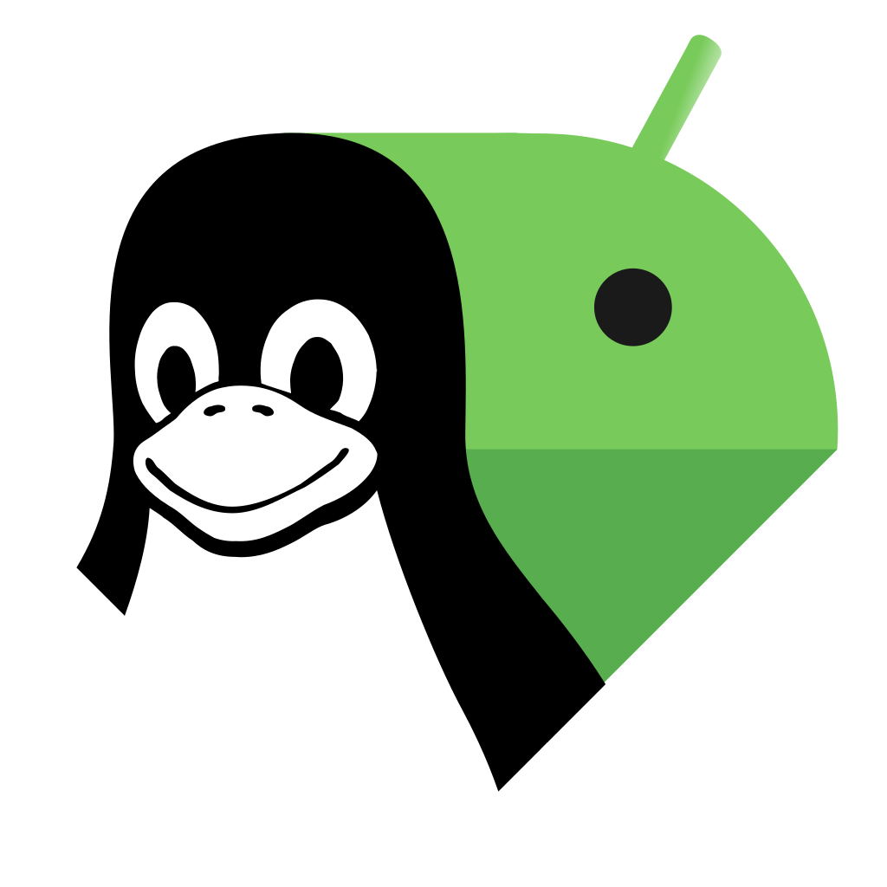

<p align="center">
  
</p>

<h1 align="center">Android Linux Bridge</h1>


[](LICENSE)
Android Linux Bridge connects an Android phone to a Linux desktop over the local network, bringing phone battery status and notifications to your computer. It consists of an Android app, a Python daemon, and a Rust desktop GUI, in the spirit of device integration tools such as KDE Connect.

[Installation](#installation) · [Features](#features) · [Building from source](#building-from-source) · [How it works](#how-it-works) · [Releases](https://github.com/belzEnn/android-linux-bridge/releases) · [Report a bug](https://github.com/belzEnn/android-linux-bridge/issues)

> [!NOTE]
> **Early development.** Intended for initial release testing, not production use. See [Current limitations](#current-limitations) before getting started.

## Installation

Android Linux Bridge consists of two parts:

- the Android application;
- the Linux daemon and desktop application.

Install the Linux side first, then install the APK on your phone and pair the devices.

### Linux

#### 1. Install dependencies

Choose your distribution:

<details>
<summary><strong>Arch Linux / Arch-based</strong></summary>

```sh
sudo pacman -S --needed \
  git \
  make \
  python \
  python-pip \
  rust \
  cargo \
  gtk4 \
  libadwaita \
  glib2 \
  libnotify \
  pkgconf \
  base-devel
```

</details>

<details>
<summary><strong>Ubuntu / Debian-based</strong></summary>

```sh
sudo apt update
sudo apt install \
  git \
  make \
  python3 \
  python3-pip \
  python3-venv \
  rustc \
  cargo \
  libgtk-4-dev \
  libadwaita-1-dev \
  libglib2.0-dev \
  libnotify-bin \
  pkg-config \
  build-essential
```

</details>

<details>
<summary><strong>Fedora</strong></summary>

```sh
sudo dnf install \
  git \
  make \
  python3 \
  python3-pip \
  rust \
  cargo \
  gtk4-devel \
  libadwaita-devel \
  glib2-devel \
  libnotify \
  pkgconf-pkg-config \
  gcc \
  gcc-c++
```

</details>

<details>
<summary><strong>openSUSE</strong></summary>

```sh
sudo zypper install \
  git \
  make \
  python3 \
  python3-pip \
  rust \
  cargo \
  gtk4-devel \
  libadwaita-devel \
  glib2-devel \
  libnotify-tools \
  pkg-config \
  gcc \
  gcc-c++
```

</details>

> Package names and available GTK/libadwaita versions may vary between distributions and releases.

#### 2. Clone the repository

```sh
git clone https://github.com/belzEnn/android-linux-bridge.git
cd android-linux-bridge
```

#### 3. Build

```sh
make
```

This checks the Python daemon and builds the Rust desktop application in release mode.

#### 4. Install

```sh
sudo make install
```

This installs the daemon launcher, daemon files, desktop application, desktop entry, and systemd user service.

#### 5. Enable the daemon

```sh
make enable
```

Check status:

```sh
systemctl --user status android-linux-bridge.service
```

Follow logs:

```sh
journalctl --user -u android-linux-bridge.service -f
```

#### 6. Start the desktop application

Launch **Android Linux Bridge** from your desktop application menu.

The daemon runs in the background through systemd and does not need to be started manually.

### Android

#### 1. Download the APK

Download the latest APK from [GitHub Releases](https://github.com/belzEnn/android-linux-bridge/releases).

Open the downloaded APK and allow installation from your browser or file manager if Android asks.

> [!WARNING]
> On some newer Android devices, Play Protect may completely block installation of the APK.
>
> If Android does not provide an **Install anyway** option, installation may require temporarily disabling Play Protect, installing Android Linux Bridge, and enabling Play Protect again afterwards.

#### 2. Open Android Linux Bridge

Start the app and complete the initial permission setup.

Depending on your Android version, Android Linux Bridge may request access required for:

- network communication;
- app notifications;
- notification access;
- background operation.

Notification access is required for notification forwarding.

#### 3. Connect the devices

Make sure your Android phone and Linux computer are connected to the same local network.

Android Linux Bridge discovers available computers automatically using mDNS.

1. Open Android Linux Bridge on your phone.
2. Select your Linux computer.
3. Request pairing.
4. Approve the pairing request in the Linux desktop application.

After successful pairing, device credentials are stored and future connections are authenticated automatically.

The Android service attempts to reconnect automatically after temporary network interruptions without requiring the app to be reopened.

If discovery does not work, make sure:

- both devices are on the same network;
- the network allows multicast/mDNS;
- guest Wi-Fi isolation is disabled;
- TCP port `4242` is not blocked by your firewall.

### Updating

```sh
git pull
make
sudo make install
systemctl --user restart android-linux-bridge.service
```

### Uninstalling

```sh
make disable
sudo make uninstall
```

The Android application can be removed normally through Android settings.

## Features

- Android app with connection status, setup controls, and activity logs.
- Rust desktop GUI built with GTK 4 and libadwaita.
- Automatic computer discovery over mDNS.
- Background reconnection after network interruptions.
- Phone battery level and charging status on the desktop.
- Pairing approval on Linux, saved device credentials, and trusted-device management.
- Android notification forwarding to Linux desktop notifications, with per-app controls.
- TLS-encrypted communication between Android and the Linux daemon.

## Building from source

### Linux

To build without installing:

```sh
git clone https://github.com/belzEnn/android-linux-bridge.git
cd android-linux-bridge
make
```

The Rust desktop binary is built at:

```text
desktop/target/release/android-linux-bridge-desktop
```

For development, individual components can also be run directly.

#### Daemon

```sh
python3 -m venv .venv
source .venv/bin/activate
python -m pip install -r requirements.txt
python -m daemon.main
```

#### Desktop GUI

```sh
cargo run --locked --manifest-path desktop/Cargo.toml
```

### Android

The app requires **Android 8.0 (API 26) or newer**. To build it, install:

- JDK 25, as selected by the repository's Gradle daemon configuration.
- Android SDK Platform 37 and Android SDK Build Tools 36.0.0.
- Android SDK Platform Tools if you want to install through `adb`.

Configure the SDK location through Android Studio or `sdk.dir` in your local `android/local.properties`. Use the included Gradle wrapper; a separate Gradle installation is unnecessary.

From the repository root:

```sh
cd android
./gradlew assembleDebug
```

The debug APK is written to:

```text
android/app/build/outputs/apk/debug/app-debug.apk
```

To install it on a connected device with USB debugging enabled:

```sh
adb install -r app/build/outputs/apk/debug/app-debug.apk
```

Release APKs are distributed separately through GitHub Releases.

## How it works

```text
Android app ↔️ local network ↔️ Linux daemon ↔️ desktop GUI
          TLS / TCP / NDJSON            Unix socket / NDJSON
```

The daemon advertises `_albridge._tcp.local.` through mDNS. Android discovers the computer and opens a TLS-encrypted TCP connection to the daemon, which listens on `0.0.0.0:4242` by default. New devices require approval in the desktop GUI; saved device credentials authenticate subsequent connections.

Both network and local IPC messages use newline-delimited JSON (NDJSON), with request, response, and event messages. The GUI talks to the daemon through a Unix socket, while the daemon forwards requests to Android and delivers incoming phone notifications through `notify-send`.

The IPC socket defaults to `$XDG_RUNTIME_DIR/android-linux-bridge.sock`, or `/tmp/android-linux-bridge-<uid>.sock` when `XDG_RUNTIME_DIR` is unset. To override it, set `ANDROID_LINUX_BRIDGE_SOCKET` to the same absolute path for both Linux processes.

## Current limitations

- This is an early Linux-first project. Compatibility across distributions and Android devices is still being tested.
- Android APK distribution is through GitHub Releases, and Play Protect may block sideloading or sensitive notification access as described above.
- Discovery currently advertises a single IPv4 address. Multicast filtering, guest Wi-Fi isolation, VPNs, or multiple network interfaces can interfere with discovery and connectivity.
- Android power management, force-stopping the app, or missing permissions can prevent background reconnection.
- Notification forwarding is basic: no replies, synchronized dismissal, or replay of notifications missed while disconnected. Ongoing notifications and group summaries are filtered out.

## Development

| Path | Purpose |
| --- | --- |
| `android/` | Kotlin/Compose Android app, Gradle wrapper, and Android tests |
| `daemon/` | Python network transport, discovery, pairing, local IPC, notifications, and tests |
| `desktop/` | Rust GTK/libadwaita GUI, IPC client, and GSettings schema |
| `packaging/` | Linux launcher, desktop entry, and systemd user service |
| `requirements.txt` | Python runtime dependencies |
| `Makefile` | Linux build, install, enable, disable, uninstall, and clean targets |

## Contributing / Issues

Open a [GitHub Issue](https://github.com/belzEnn/android-linux-bridge/issues) for bugs or suggestions.

For bug reports, include the release version or commit, Linux distribution and desktop environment, Android version and phone model, reproduction steps, and expected versus actual behavior. Attach relevant daemon or Android logs after removing pairing tokens, notification content, and other personal information.

Testing on additional devices, documentation fixes, and code contributions are welcome. For substantial changes, open an issue to discuss the approach first.

## License

Licensed under the [MIT License](LICENSE).
